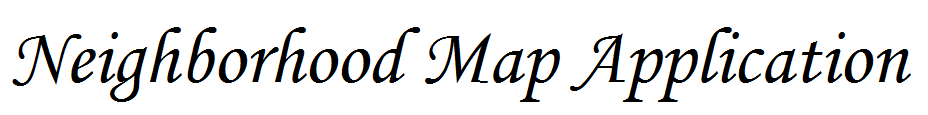

<link href="https://fonts.googleapis.com/css?family=Playball" rel="stylesheet">

<p align="center">
  <a href="#"></a>
</p>
<p align="center">
  <a href="https://opensource.org/licenses/MIT" target="_blank">
    
  </a>
  <a href="#" target="_blank">
    
  </a>
  <a href="https://travis-ci.org/ankur-dauneria/neighborhood-map-gulp" target="_blank">
    
  </a>
</p>

> Neighborhood Map Application is fully responsive single page Javascript application built over MVVM model using Knockout.JS library. The front-end was built using HTML, CSS and Bootstrap 3 framework. It incorporates a google map api and variety of data using Wikipedia API to display additional information like photos, heritage site status about the location, on the google map. Different locations are read from user provided JSON and displayed over the map. It uses Ajax to handle wikipedia/wikidata APIs to get the data to be displayed on the map. On UI, it filters the locations as user types them and displays accordingly on the map. A location infowindow can be clicked directly from marker or from list view.

## Features

> Its fully responsive (NEXUS 5, iPad) single page JS application built using knockout.js

> Its uses google maps to display the user choice locations over its.

> Its uses third party (Wikipedia/Wikidata) api to get the data and display them inside the infowindow. Third party API are used to location photo and checks if the place is a designated heritage site. It presents site information of each site as per the category.

> Filters locations on map both in list view and map markers as user types them

> Filter locations on map and list view as user draw a polygon to limit the search into an area

> Filters locations on map and list view based on list of tags, other than just location names

> Google map uses a custom style

> Gulp driven build

> Travis driven continuous integration(ci) integration

## Preview


## Getting started

### Prerequisite

Install `Node.js`.

This full stack project can be started using

```
    git clone https://github.com/ankur-dauneria/neighborhood-map-gulp.git
    cd neighborhood-map-gulp

```

Go to `dest` folder and click `index.html` and open it in Google chrome web browser.

## Build

Build is setup using gulp. Following steps to be executed in `neighborhood-map-gulp` folder

> `npm install --global gulp-cli`

> `gulp init`

> `npm install --save gulp gulp-concat gulp-minify-css gulp-uglify browsr-sync`

> `gulp default`


Go to `localhost:3000` in google chrome web browser

## Tools used

* Frontend: HTML, CSS, JS, Bootstrap 3 web framework
* JS Framework : Knockout.JS
* Fonts: Font awesome


## Project structure

It is fully responsive single page JS application following MVVM model built using knockout.js.

> `map.js`: is the main JS file containing all javascript code. It contains code for wikipedia and wikidata api calls for fetch location photos and heritage status of a site.

> `style.css`: contains the CSS.

> `index.html`: contains the HTML code of the web page.

> `gulpfile.js`: build rules to setup th build.

> `.travis.yml`: Continuous integration configuration.

## Found issue/Report new feature

Please report it via Issues tab

## References

> Stackoverflow.com

> W3Schools.com

> getbootstrap.com

## License

This project is licensed under [MIT License](license.md)